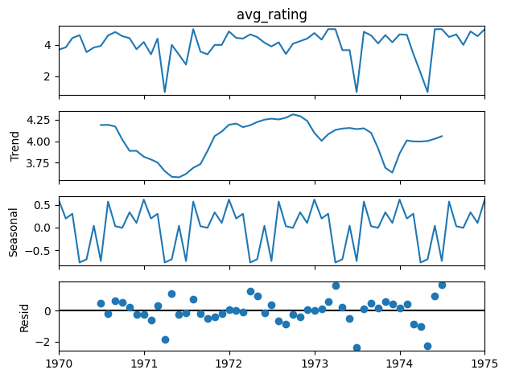
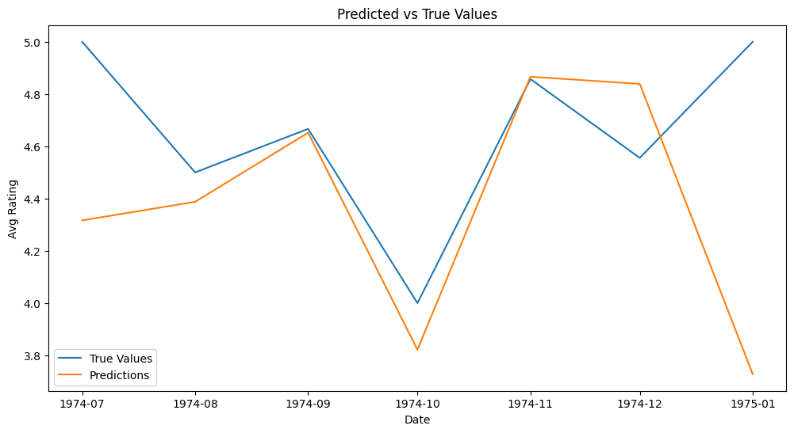
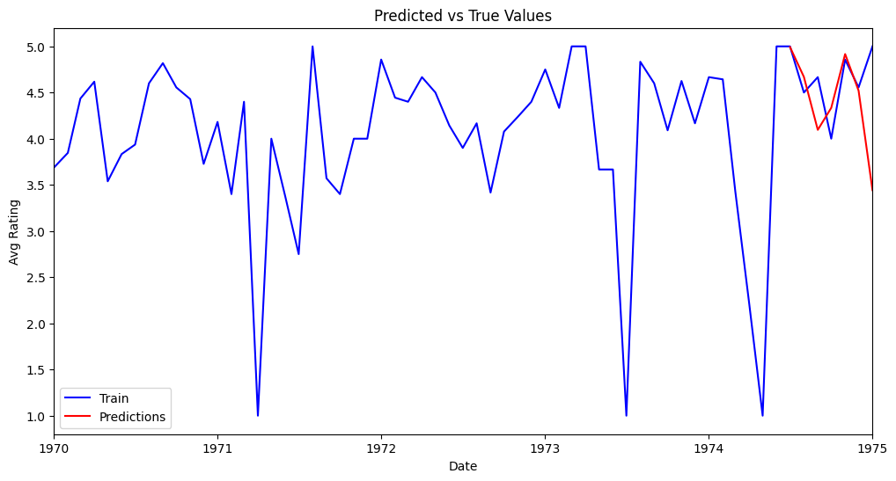
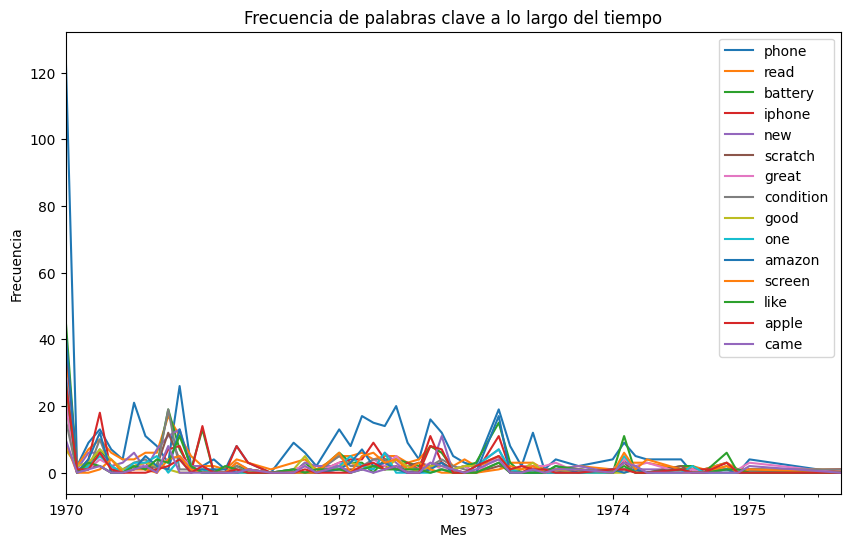
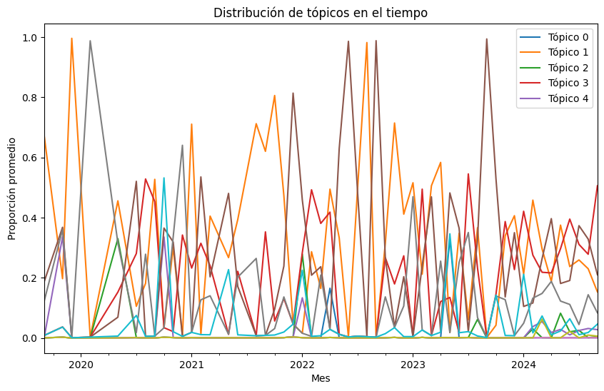
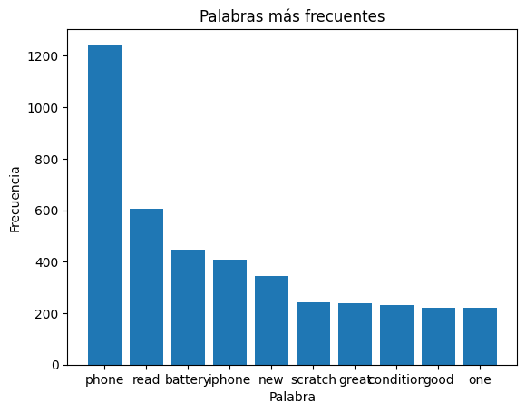

## Análisis de estacionariedad de la serie temporal

Para comprobar si la serie es estacionaria, utilizamos el método *Dickey-Fuller aumentado (ADF)*. Los resultados obtenidos fueron los siguientes:

•⁠  ⁠*ADF Statistic:* -6.5117  
•⁠  ⁠*p-value:* 1.0964e-08  
•⁠  ⁠*Valores críticos:*  
  - Nivel de significancia del 1%: -3.5444  
  - Nivel de significancia del 5%: -2.9111  
  - Nivel de significancia del 10%: -2.5932  

Dado que el p-valor es menor a 0.05, rechazamos la hipótesis nula, lo que indica que la serie es estacionaria.

En el seasonal descompose vemos como claramente se repite un patrón a lo largo del tiempo.

## Selección del modelo ARMA

En primer lugar, se probó un modelo *ARMA* evaluando todas las posibles combinaciones de parámetros. Tras realizar la comparación, se determinó que el mejor modelo, basado en el menor *MAE* (Error Absoluto Medio), es el modelo autorregresivo con *p = 12*.

•⁠  ⁠*MAE obtenido en el conjunto de test:* 0.365

## Selección del modelo SARMA

El mejor modelo *SARMA* encontrado tiene las siguientes características:

•⁠  ⁠*Orden:* (23, 0, 0)  
•⁠  ⁠*Orden estacional:* (0, 0, 1, 6)  
•⁠  ⁠*MAE:* 0.3905  

A pesar de ser el mejor modelo SARMA, sus resultados son inferiores al modelo ARMA previamente seleccionado, que obtuvo un *MAE* de 0.365 en el conjunto de test.

## Frecuencia de Palabras Clave a lo Largo del Tiempo

- **Descripción**: Este gráfico muestra cómo evoluciona la frecuencia de palabras clave específicas a lo largo del tiempo. Se incluyen términos como "phone", "battery", "amazon", entre otros.
- **Análisis**:
  - La palabra "phone" domina en frecuencia, especialmente al inicio del periodo analizado.
  - La mayoría de las palabras muestran una disminución en su frecuencia con el tiempo, lo que podría reflejar cambios en la relevancia de los temas asociados.
  - Picos esporádicos en palabras como "iphone" y "screen" pueden indicar eventos específicos o lanzamientos relevantes.

---

## Distribución de Tópicos en el Tiempo

- **Descripción**: Este gráfico muestra cómo varía la proporción de tópicos identificados a lo largo del tiempo, basado en análisis de temas con técnicas de modelado de tópicos.
- **Análisis**:
  - Los tópicos presentan comportamientos cíclicos, sugiriendo que ciertos temas ganan y pierden relevancia en períodos específicos.
  - Tópicos como el "Tópico 1" tienen un comportamiento más estable, mientras que otros como el "Tópico 3" muestran picos pronunciados, lo que podría estar relacionado con eventos puntuales.
 
---
# Análisis de Tópicos

## Tópicos Identificados
El análisis de modelado de tópicos permitió identificar cinco conjuntos representativos de términos recurrentes en el corpus:

### Tópico 0
- **Palabras clave**: ['phone', 'iphone', 'battery', 'read', 'new', 'apple', 'amazon', 'pro', 'great', 'max']
- **Enfoque**: Discusiones sobre dispositivos tecnológicos y modelos avanzados.

### Tópico 1
- **Palabras clave**: ['phone', 'read', 'battery', 'scratch', 'new', 'condition', 'seller', 'iphone', 'screen', 'brand']
- **Enfoque**: Calidad del producto y experiencia con el vendedor.

### Tópico 2
- **Palabras clave**: ['phone', 'read', 'great', 'battery', 'good', 'came', 'condition', 'work', 'new', 'screen']
- **Enfoque**: Funcionamiento general y experiencia del producto.

### Tópico 3
- **Palabras clave**: ['phone', 'amazon', 'read', 'iphone', 'return', 'work', 'told', 'refund', 'took', 'apple']
- **Enfoque**: Problemas postventa y devoluciones.

### Tópico 4
- **Palabras clave**: ['phone', 'iphone', 'like', 'screen', 'new', 'day', 'brand', 'money', 'read', 'buying']
- **Enfoque**: Experiencia de compra y relación calidad-precio.

---

## Palabras Más Frecuentes

- **Descripción**: Este gráfico de barras resalta las palabras más frecuentes en el conjunto de datos textuales analizados.
- **Análisis**:
  - La palabra "phone" es significativamente más frecuente que las demás, indicando su alta relevancia en el conjunto de datos.
  - Términos como "battery", "iphone" y "amazon" reflejan la naturaleza tecnológica de los textos analizados.
  - Este análisis es un paso inicial hacia la comprensión de los temas predominantes en el corpus.

---
